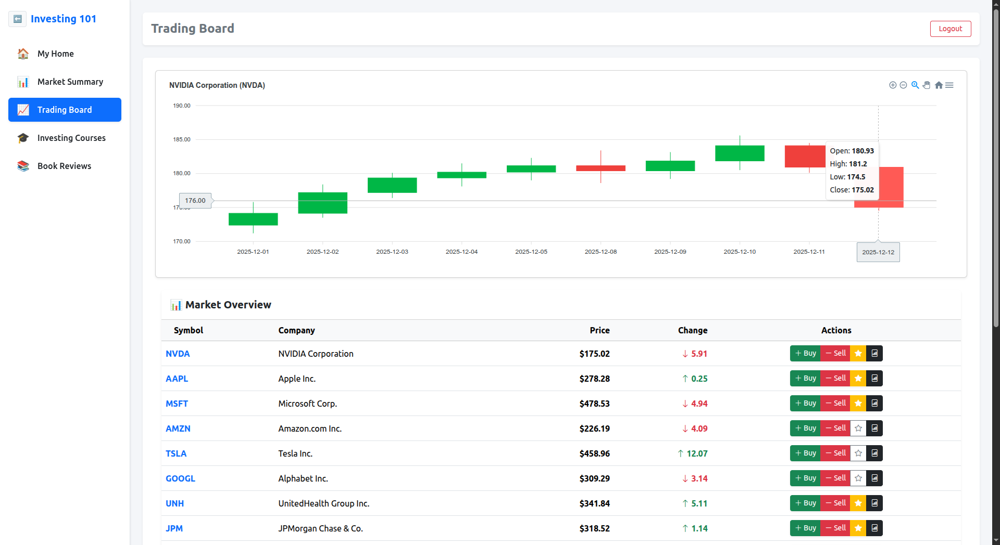

# Stock Trading Demo for LEO CDP



This project is a **React.js demo application** served via **local Nginx** at [`https://trading.example.com`](https://trading.example.com).
It simulates a stock trading interface while testing **LEO CDP tracking** integration.

---

## 🚀 Features

* React.js frontend (loaded into `#root`)
* Bootstrap 5 + TailwindCSS styling
* Local mock stock data (`/mock/stocks.json`)
* Default login user (`test / 1234`)
* LEO CDP **event observer** integration (`cdp.tracking.js`)

---

## 📂 Project Structure

```
public/
 ├─ index.html        # Main entry (React mounts here)
 ├─ cdp.tracking.js   # LEO CDP tracking script
 ├─ mock/stocks.json  # Sample stock data
src/
 ├─ App.js            # React root component
 └─ ...
```

---

## ⚙️ Local Setup (Ubuntu / macOS / Windows WSL)

### 1. Clone Repo & Install Dependencies

```bash
git clone https://gitlab.innotech.vn/cdp-ai/demo-app-leocdp.git
cd demo-app-leocdp
npm install
```

### 2. Build React App

```bash
npm run build
```

This generates static files under `build/`.

### 3. Configure Nginx with SSL

Create `/etc/nginx/sites-available/trading.example.com`:

```nginx
server {
    listen 80;
    listen [::]:80;
    server_name trading.example.com;

    return 301 https://$host$request_uri;
}

server {
    listen 443 ssl;
    listen [::]:443 ssl;

    server_name trading.example.com;

    root /var/www/trading.example.com/build;
    index index.html;

    ssl_certificate     /etc/ssl/certs/trading.example.com.crt;
    ssl_certificate_key /etc/ssl/private/trading.example.com.key;

    location / {
        try_files $uri /index.html;
    }
}
```

Enable site:

```bash
sudo ln -s /etc/nginx/sites-available/trading.example.com /etc/nginx/sites-enabled/
sudo nginx -t
sudo systemctl restart nginx
```

---

## 🖥️ Hosts File Update

Since `trading.example.com` is local, add it to your **hosts file**:

### Ubuntu/macOS

```bash
sudo nano /etc/hosts
```

```
127.0.0.1   trading.example.com
```

### Windows

Edit `C:\Windows\System32\drivers\etc\hosts`:

```
127.0.0.1   trading.example.com
```

---

## 🔒 SSL Setup (Self-Signed for Local Dev)

Generate a self-signed certificate (valid for 1 year):

```bash
sudo openssl req -x509 -nodes -days 365 \
  -newkey rsa:2048 \
  -keyout /etc/ssl/private/trading.example.com.key \
  -out /etc/ssl/certs/trading.example.com.crt
```

---

## 📡 LEO CDP Tracking

The page includes a **tracking observer**:

```html
<script>
  (function () {
    window.leoObserverId = "5I9aOHpjf5RdFOGw6z7cHZ";
    window.leoObserverLogDomain = "datahub4dcdp.bigdatavietnam.org";
    window.leoObserverCdnDomain = "leocdp.example.com/public/";
  })();
</script>
<script src="cdp.tracking.js"></script>
```

* `leoObserverId` → unique observer key
* `leoObserverLogDomain` → logs CDP events
* `leoObserverCdnDomain` → loads tracking assets

All user interactions will be sent to **LEO CDP** for testing and verification.

---

## ✅ Testing

1. Build React app and serve via Nginx (`https://trading.example.com`).
2. Open browser: [https://trading.example.com](https://trading.example.com).
3. Login with test user (`test / 1234`).
4. Check network requests → events should flow to `datahub4dcdp.bigdatavietnam.org`.

---

## 📖 Notes

* Works on Ubuntu, macOS, and Windows (with WSL or local Nginx).
* For production, replace self-signed SSL with **Let’s Encrypt**.
* The demo is for **local testing** of **LEO CDP tracking** and should not be used as-is in production.

---

## Check customer 360 report at DEV server

* https://dcdp.bigdatavietnam.org/#calljs-leoCdpRouter('Data_Journey_Map','1qtwifbEDNz8uqxF3U00if')
* Username: demo
* Password: 12345678

### Screenshot of customer 360 report 


